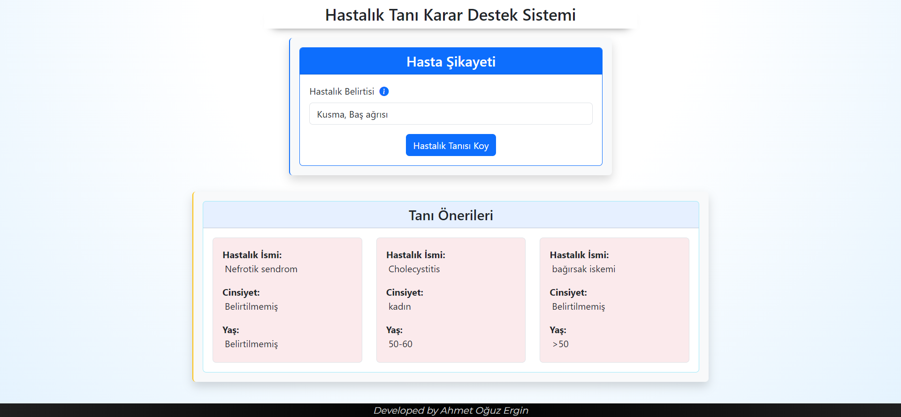

<h1 align="center">Disease Diagnosis Decision Support System</h1>  

    

 

## Table of Contents

- [Demo](#demo)
- [Introduction](#introduction)
- [Technologies](#technologies)
- [Features](#features)
- [Contributors](#contributors)

 

## Demo

 

    

 

## Introduction

This project is an artificial intelligence application developed using the Python programming language. Its core functionality is based on the implementation of the decision tree algorithm, allowing for efficient analysis of user input and providing disease diagnoses. The program provides its services through a web interface.

 

## Technologies

* Python
* Html, Jinja
* Css

 

## Features
* The diagnoses of the three closest diseases have been provided.
* Presentation of the project and report is also included in the document part.

 

## Contributors

Project idea is belongs to Ersin Aksoy from Innova.

